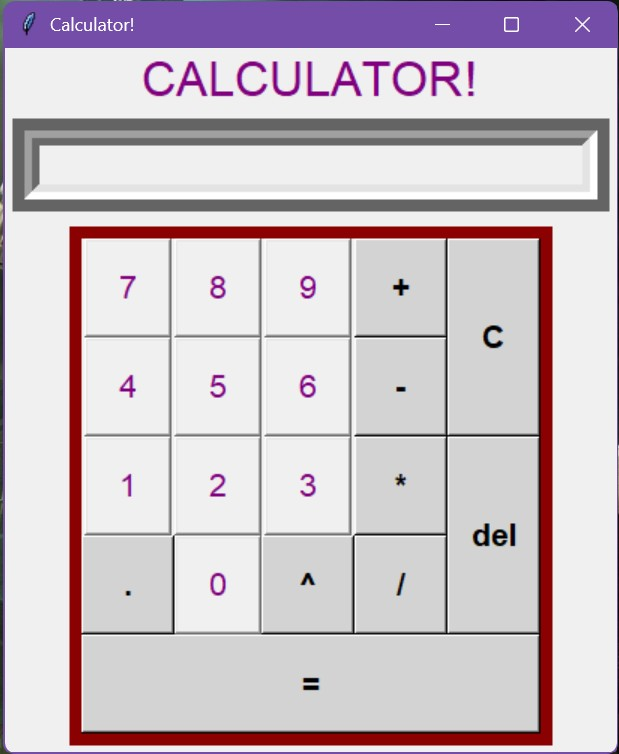

# Calculator

A desktop calculator built using Python and Tkinter.

The application provides a graphical calculator interface that supports keyboard input, safe expression evaluation, and basic arithmetic operations.

[](https://github.com/Krish0030/Calculator/releases/latest)

---

## Features

- Graphical calculator interface built with Tkinter  
- Safe expression evaluation using restricted `eval()`  
- Regex-based input validation  
- Keyboard input support  
- Power operator (`^`) support  
- Delete last character function  
- Clear display button  

---

## Screenshot



---

## How It Works

The calculator prevents malicious input by validating expressions using regular expressions before evaluation.

Allowed characters:

```
0-9  +  -  *  /  .  ( )  ^
```

The power operator (`^`) is internally converted to Python's exponent operator (`**`) before evaluation.

---

## Run the Application

Clone the repository:

```bash
git clone https://github.com/Krish0030/Calculator.git
cd Calculator
```

Run the program:

```bash
python Calculator_final.py
```

---

## Build Executable

To create a standalone Windows executable using PyInstaller:

```bash
pyinstaller --onefile --windowed --icon=calculator_logo.ico Calculator_final.py
```

The executable will be generated inside the `dist` folder.

---

## Technologies Used

- Python
- Tkinter
- Regular Expressions

---

## Project Structure

```
Calculator
│
├── Calculator_final.py
├── calculator_logo.ico
├── LICENSE
├── README.md
│
└── Screenshots
     └── app.png
```

---

## License

This project is licensed under the MIT License.
